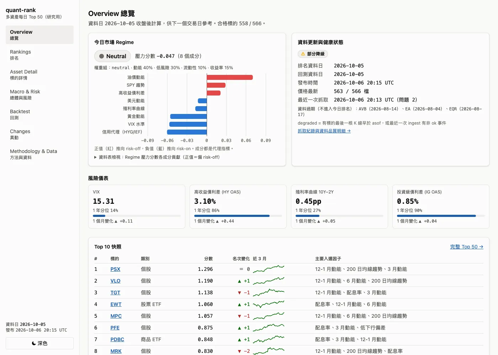
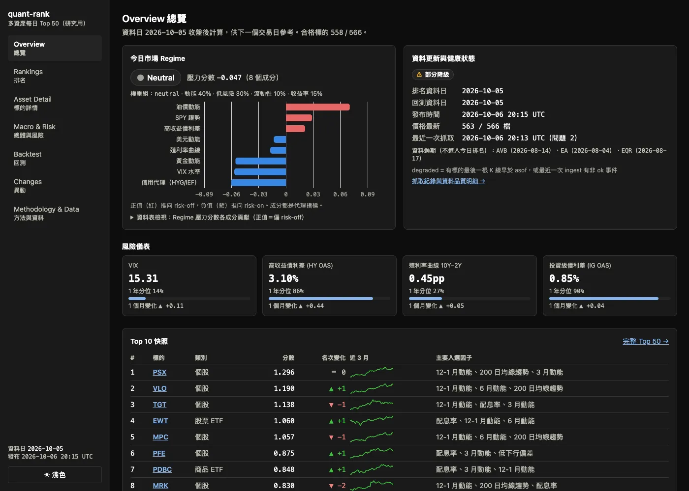
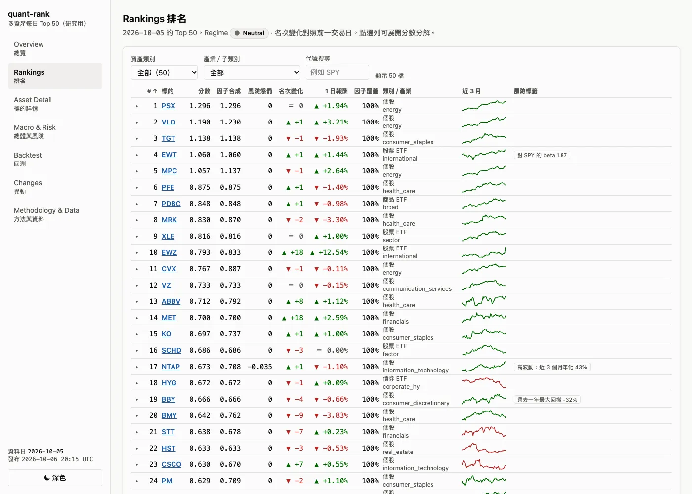
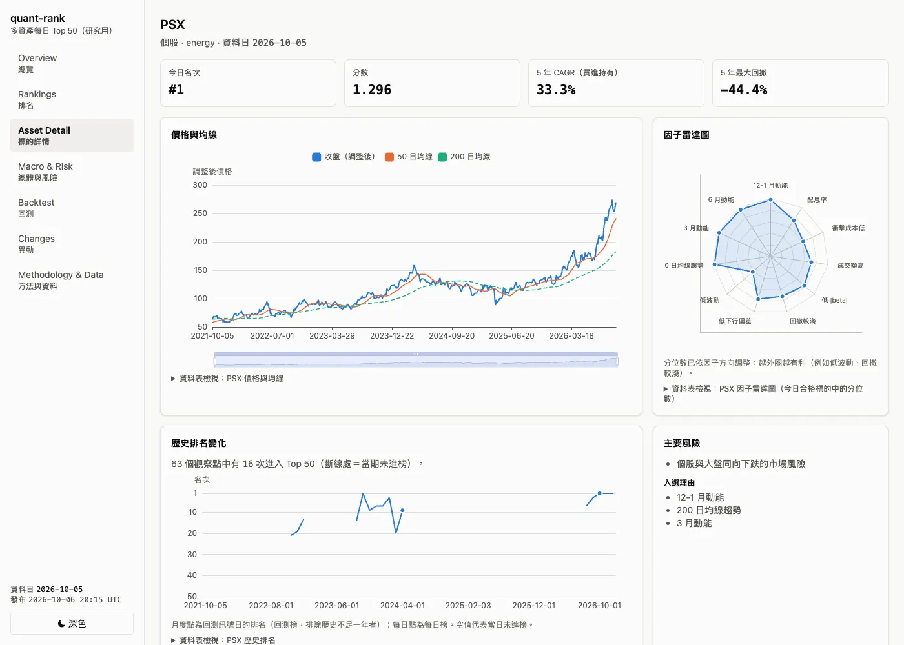
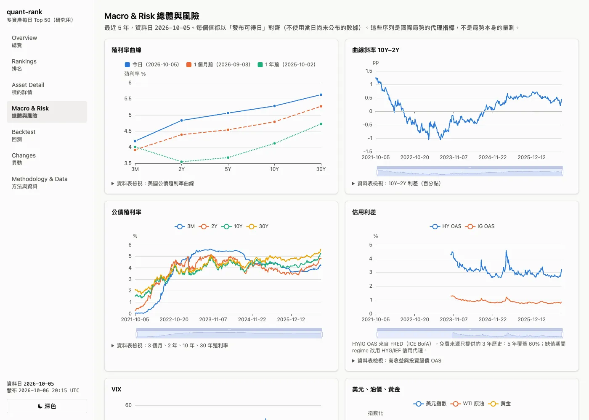
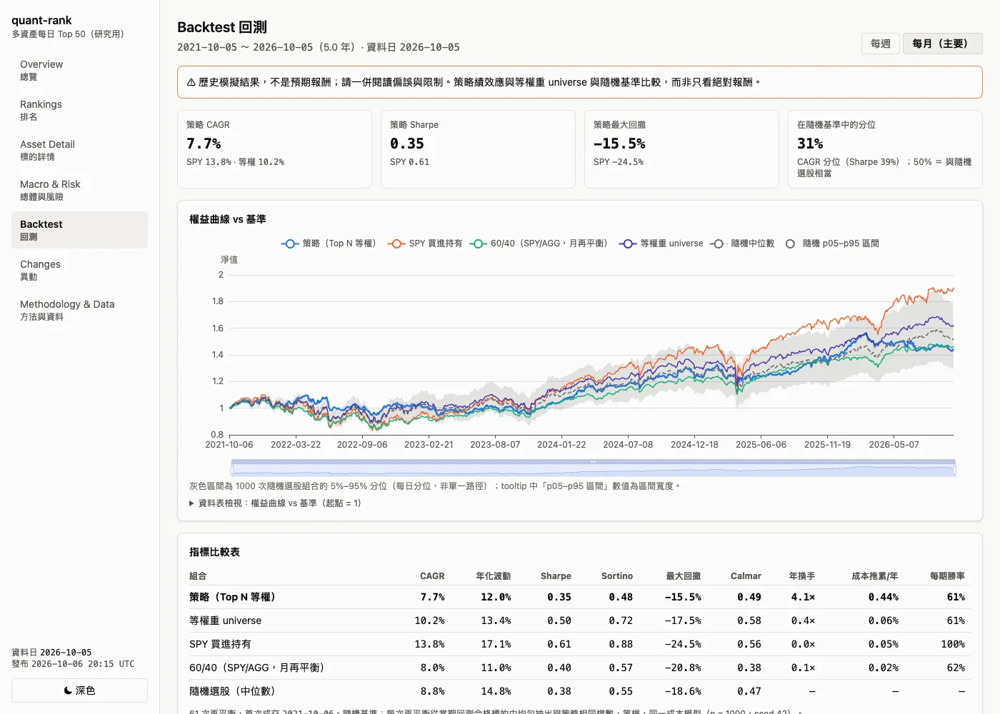
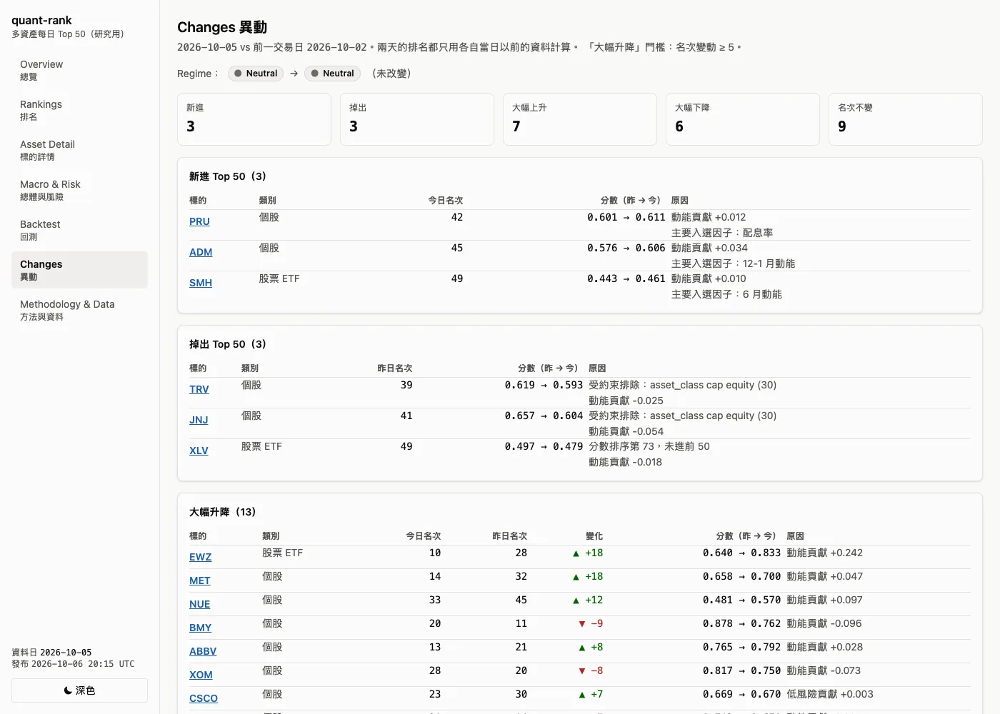
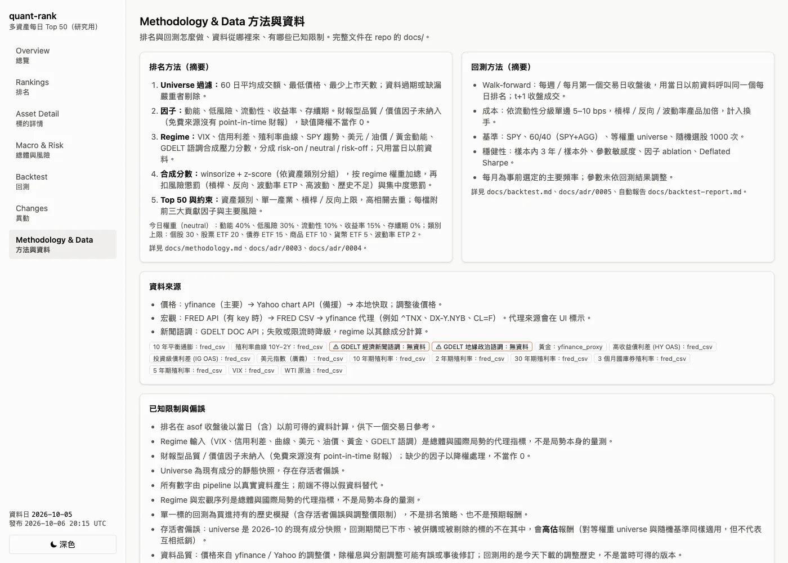

# quant-rank-dashboard

每天自動從美股、美債、ETF 與衍生性金融產品（ETF/ETN 形式）中，依總體環境、市場行情與風險，選出並排名 Top 50 標的，並附上專業 Dashboard 與嚴謹的 3–5 年回測。

> **免責聲明**：本專案僅供研究與學習，不構成投資建議。回測結果不代表未來表現，且受存活者偏誤、資料品質與交易成本假設影響。

- **線上 Dashboard**：<https://trippleway.github.io/quant-rank-dashboard/>（每個美股交易日 22:30 UTC 由 GitHub Actions 自動更新）
- **狀態**：M0–M6 已完成（資料層、特徵與 regime、排名、回測、前端、每日自動化與部署）；M7 收尾審查中。規格見 [`PLAN.md`](PLAN.md)，進度見 [`HANDOFF.md`](HANDOFF.md)。

## 它做什麼

```
ingest（價量、宏觀、GDELT；備援 + 快取）→ features（因子、regime）→ scoring（Top 50 + 約束）
    → backtest（walk-forward，約每週一次）→ publish（版本化 JSON）→ web（靜態 React 網站）→ GitHub Pages
```

- **Universe**：566 檔種子清單（412 檔美國大中型股 + 91 檔股票 ETF〔產業／主題／國家，含槓桿／反向〕、31 檔債券 ETF、19 檔商品、8 檔貨幣、5 檔波動率 ETF/ETN），依流動性、價格、上市天數過濾。
- **排名**：動能、風險、流動性、配息率等因子做類別內／全體橫斷面標準化，依規則式 regime（risk-on / neutral / risk-off）加權，扣風險與集中度懲罰；類別、產業、槓桿類上限與相關性去重。每檔附分數分解、入選理由與主要風險。見 [`docs/methodology.md`](docs/methodology.md)。
- **「國際局勢」是代理指標**：VIX、信用利差、殖利率曲線、美元與油價／黃金動能、GDELT 語調，不是局勢本身的量測。
- **回測**：直接重用每日排名函式、只用 t 日收盤前資料、t+1 收盤成交；依流動性分級的成本；每週與每月再平衡；SPY、60/40、等權 universe、1000 次隨機選股基準；樣本內外切分、參數敏感度、ablation、Deflated Sharpe。見 [`docs/backtest.md`](docs/backtest.md)。
- **沒有 look-ahead**：特徵、regime、排名與回測都有「截掉未來資料結果不變」的測試。

### 回測結果（誠實版）

最新報告：[`docs/backtest-report.md`](docs/backtest-report.md)（資料截至 2026-10-05，5 年，主要頻率事前選定為每月）。

| 每月再平衡 | CAGR | Sharpe | 最大回撤 |
|---|---:|---:|---:|
| 策略（Top 50 等權） | 7.7% | 0.35 | −15.5% |
| 等權重 universe | 10.2% | 0.50 | −17.5% |
| SPY 買進持有 | 13.8% | 0.61 | −24.5% |
| 隨機選 50 檔（中位數） | 8.8% | 0.38 | −18.6% |

**策略在這段期間沒有打敗 SPY、等權 universe，也不優於隨機選股的中位數**（CAGR 位於隨機基準第 31 百分位）；Rank IC 約 0.01、統計上不顯著。優點只在回撤較淺、波動較低。結果另受存活者偏誤（用現有成分股回測會高估）、yfinance 調整價品質與容量限制影響，詳見報告的「偏誤與限制」。這是一個方法嚴謹、可重現的研究框架，不是一個已被證明有效的選股策略。

## 截圖

真實 pipeline 輸出（資料日期 2026-10-05，非 DEMO；資料健康狀態「部分降級」如實顯示）。由 `make web-screenshots` 以 headless Chrome 產生。

| | |
|---|---|
|  |  |
| **Overview** — 今日 regime 與成分貢獻、風險儀表、Top 10、資料健康 | **深色主題** |
|  |  |
| **Rankings** — 篩選、排序、可展開分數分解、sparkline、風險標籤 | **Asset Detail** — 價格與均線、因子雷達、歷史排名、單獨回測 |
|  |  |
| **Macro & Risk** — 殖利率曲線、利差、美元／油價／黃金、GDELT、regime 時間軸 | **Backtest** — 權益曲線 vs 基準、指標表、回撤、熱力圖、穩健性 |
|  |  |
| **Changes** — 新進、掉出、大幅升降與原因 | **Methodology & Data** — 方法、資料來源、限制、免責聲明 |

## 快速開始

需要 Python 3.11+ 與 `make`。

```bash
make install   # 建立 .venv 並安裝套件與開發工具
make test      # pytest
make lint      # ruff check + ruff format --check + mypy --strict
```

選用：複製 `.env.example` 為 `.env` 並填入 `FRED_API_KEY`（沒有也能跑，會走備援來源）。

抓取資料（寫入 `data/`，不進 git）：

```bash
make ingest                                  # 全 universe 增量更新（價格 + 宏觀 + GDELT）
.venv/bin/qrd ingest --tickers SPY,TLT --no-sentiment   # 只抓部分標的
make features                                # 計算因子、宏觀面板與 regime（需先 ingest）
make rank                                    # 計算分數並選出 Top 50（data/rankings/，需先 features）
.venv/bin/qrd rank --asof 2024-06-28         # 對過去某日排名（不更新 latest.json）
make backtest                                # walk-forward 回測（data/backtest/ + docs/backtest-report.md）
make publish                                 # 前端用的靜態 JSON（web/public/data/）
.venv/bin/qrd universe                       # 查看 universe 組成
make daily                                   # 一行跑完整條每日 pipeline（ingest → … → publish）
```

前端（Node 20+；見 [`web/README.md`](web/README.md)）：

```bash
make web-install   # npm ci
make web-dev       # 開發伺服器，讀 web/public/data/
make web-build     # 靜態網站到 web/dist/
make web-check     # headless Chrome 檢查七個頁面（深淺色）無 console 錯誤
make web-screenshots  # 同上，並更新 docs/screenshots/（README 截圖）
```

資料來源、欄位與限制見 [`docs/data-dictionary.md`](docs/data-dictionary.md)；排名方法見 [`docs/methodology.md`](docs/methodology.md)；回測方法見 [`docs/backtest.md`](docs/backtest.md)，最新報告見 [`docs/backtest-report.md`](docs/backtest-report.md)；每日排程、部署與失敗處理見 [`docs/operations.md`](docs/operations.md)。

## 文件導覽

| 檔案 | 用途 |
|---|---|
| `PLAN.md` | 目標、架構、排名方法、回測規格、Dashboard 規格、里程碑 |
| `CLAUDE.md` | Lead agent 的工作規則 |
| `AGENTS.md` | Lead 與 Reviewer 共用規則與審查清單 |
| `HANDOFF.md` | 進度交接與討論紀錄 |
| [`docs/`](docs/README.md) | 方法論、資料字典、回測方法與報告、營運手冊、ADR |
| [`web/README.md`](web/README.md) | 前端頁面、建置與設計規則 |

## 專案結構

```
src/qrd/    ingest/ universe/ features/ scoring/ backtest/ publish/ daily.py cli.py
tests/      pytest（含 look-ahead、韌性、端到端 fixture 測試）
web/        Vite + React + TypeScript + Tailwind + ECharts
docs/       方法論、資料字典、回測、營運、ADR、截圖
.github/    ci.yml（lint + test，Python 3.11/3.12 + web）、daily.yml、deploy.yml
data/       產生的資料（gitignored）
```

## 已知限制

- 免費資料源：yfinance 調整價可能事後改寫；GDELT 常回 429 而降級；FRED 沒有 API key 時走 CSV／yfinance 代理。
- 沒有 point-in-time 成分股與財報：存活者偏誤，且不做財報型品質／價值因子。
- 交易所假日照跑只發警告；Actions cache 會過期（冷啟動結果相同，只是較慢）。
- 依賴未鎖版。更多見 [`docs/operations.md`](docs/operations.md) 與 HANDOFF.md 的 Backlog。

## 如何用 agent 自動開發

1. 在本 repo 根目錄開一個 Lead（Claude Code），讓它讀 `CLAUDE.md`。
2. 開另一個 Reviewer agent，讓它讀 `AGENTS.md`。
3. 兩者依 `AGENTS.md` 的「討論流程」透過 `HANDOFF.md` 交接，每個里程碑最多 3 輪。
4. 看到 `HANDOFF.md` 的狀態是 `NEEDS_HUMAN` 時，回來處理「Needs human」清單。

建議給 Lead 的第一句話：

> 請閱讀 PLAN.md、CLAUDE.md、AGENTS.md、HANDOFF.md，從 M0 開始，依規則自動推進，遇到停止條件就停下並更新 HANDOFF.md。

## 授權

尚未指定（由 repo 擁有者決定）。
